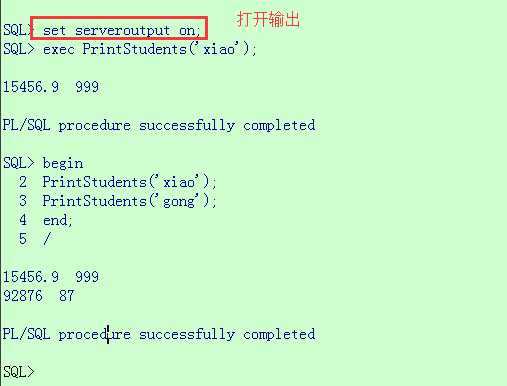

> 这个世界上肯定有另一个我，做着我不敢做的事，过着我想过的生活。挑战自己不擅长的事，敢于说走就做的旅行，每天做很多新鲜的事。极致的幸福，存在于孤独的深海。在这样日复一日的生活里，我逐渐和自己达成和解。


**##1.  ORACLE的启动和关闭 
###1、在单机环境下 
要想启动或关闭ORACLE系统必须首先切换到ORACLE用户，如下 
```
su - oracle 
```

a、启动ORACLE系统 
```
oracle>svrmgrl 
SVRMGR>connect internal 
SVRMGR>startup 
SVRMGR>quit 
```

b、关闭ORACLE系统 
```
oracle>svrmgrl 
SVRMGR>connect internal 
SVRMGR>shutdown 
SVRMGR>quit 
```

启动oracle9i数据库命令： 
```
$ sqlplus /nolog 
SQL*Plus: Release 9.2.0.1.0 - Production on Fri Oct 31 13:53:53 2003 
Copyright (c) 1982, 2002, Oracle Corporation.  All rights reserved. 
SQL> connect / as sysdba  
Connected to an idle instance. 
SQL> startup^C 
SQL> startup 
ORACLE instance started. 
```

###2、在双机环境下 
要想启动或关闭ORACLE系统必须首先切换到root用户，如下 
su － root 
a、启动ORACLE系统 
hareg －y oracle 
b、关闭ORACLE系统 
hareg －n oracle 
Oracle数据库有哪几种启动方式

**##2.  导入数据
```
C:\Users\tony>sqlldr
SQL*Loader: Release 11.2.0.1.0 - Production on 星期六 9月 3 09:12:45 2011
Copyright (c) 1982, 2009, Oracle and/or its affiliates.  All rights reserved.
```
用法: SQLLDR keyword=value [,keyword=value,...]
有效的关键字:
    userid -- ORACLE 用户名/口令
   control -- 控制文件名
       log -- 日志文件名
       bad -- 错误文件名
      data -- 数据文件名
   discard -- 废弃文件名
discardmax -- 允许废弃的文件的数目         (全部默认)
      skip -- 要跳过的逻辑记录的数目  (默认 0)
      load -- 要加载的逻辑记录的数目  (全部默认)
    errors -- 允许的错误的数目         (默认 50)
      rows -- 常规路径绑定数组中或直接路径保存数据间的行数
               (默认: 常规路径 64, 所有直接路径)
  bindsize -- 常规路径绑定数组的大小 (以字节计)  (默认 256000)

    silent -- 运行过程中隐藏消息 (标题,反馈,错误,废弃,分区)
    direct -- 使用直接路径                     (默认 FALSE)
   parfile -- 参数文件: 包含参数说明的文件的名称
  parallel -- 执行并行加载                    (默认 FALSE)
使用的默认的， 没有加入 direct=true . 
执行的脚本类似： 
$ sqlldr   [email=user1/passwd1@db1]user1/passwd1@db1[/email]   control=xxx.ctl

**## 3. 函数与存储过程

*1. 函数demo：
```
create or replace procedure sy_merge_label(
      par1 varchar2 in,
      par2 varchar2 out
) as

 CURSOR C_LABEL IS
  select rownum,ENT_MD5,ENT_LABEL from crt_ent_label group by ENT_MD5;
 C_ROW C_LABEL%ROWTYPE;
 rown int;
 md5 varchar2;
 md5_old int:=0;
 label varchar2; 
 TYPE arry_num IS VARRAY(100) OF NUMBER; 
 rownums arry_num; 

begin

 FOR C_ROW IN C_LABEL LOOP
  --处理逻辑
  rown:=C_ROW.rownum;
  md5:= C_ROW.ENT_MD5;
  label:=C_ROW.ENT_LABEL;
  if label in ('医学考试') then
    --if md5_old != md5 then
    
    --else
      
    --DBMS_OUTPUT.PUT_LINE(md5||label)
  end if  
 END LOOP

EXCEPTION  
  WHEN no_data_found THEN  
    raise_application_error(-20000, '该员工不存在');  

end sy_merge_label 
```
*2.  解释：
PL/SQL中的过程和函数（通常称为子程序）是PL/SQL块的一种特殊的类型，这种类型的子程序可以以编译的形式存放在数据库中，并为后续的程序块调用。

相同点： 完成特定功能的程序 


不同点：是否用return语句返回值。
举个例子：
```
create or replace procedure PrintStudents(p_staffName in xgj_test.username%type) as
 
 cursor c_testData is
 select t.sal, t.comm from xgj_test t where t.username = p_staffName;
 
begin
 
 for v_info in c_testData loop
 DBMS_OUTPUT.PUT_LINE(v_info.sal || ' ' || v_info.comm);
 end loop;
 
end PrintStudents;
```
一旦创建了改程序并将其存储在数据库中，就可以使用如下的方式调用该过程
```
begin
 PrintStudents('Computer Science');
 PrintStudents('Match');
end;
/
```
或者
```
exec PrintStudents('Computer Science');
exec PrintStudents('Match');
 
```
在命令窗口中： 


在pl/sql工具的sql窗口中： 


## 总结


整个文章的基本组织结构依照典型的工科思维方式进行串接，即从理论到实践。