>     这个世界上肯定有另一个我，做着我不敢做的事，过着我想过的生活。挑战自己不擅长的事，敢于说走就做的旅行，每天做很多新鲜的事。极致的幸福，存在于孤独的深海。在这样日复一日的生活里，我逐渐和自己达成和解。

## 一.  项目概况
首先，总体介绍下这个小项目  
网站界面如下图所示：  

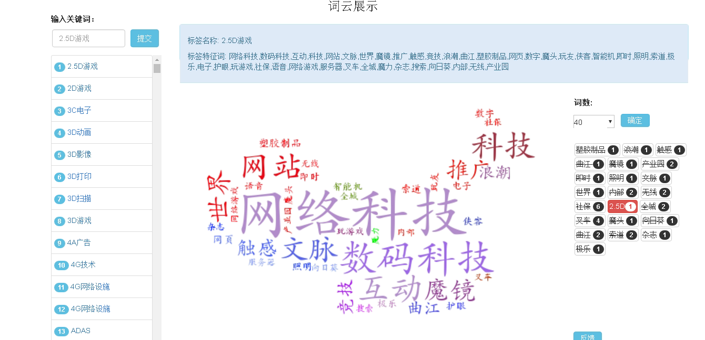  
图1 &nbsp;&nbsp;词云主界面    
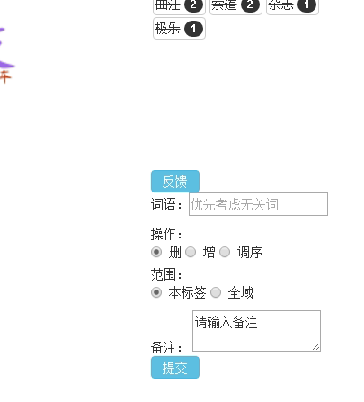   
图2 &nbsp;&nbsp;词云主界面反馈部分  

 
####**1. 需求**：
公司由于业务需要，需要对300多万家企业进行打标签。事先人工整理好了1500多个标签然后通过solr打分框架给企业打上初步的标签，这些数据作为标签2.0的训练集进行机器学习打标签。  

####**2. 功能**：
进行标签2.0的第一步对标签进行特征提取，提取出的特征向量能否有效的代表标签，以及利用标签的特征向量进行行业的初步分析，因此我们开发了词云展示系统，另外我们添加了词云反馈功能，用于让用户对词云结果提出意见，促进词云的改进。

####**3. 软件技术栈：**  
- 网站：django框架  
- 前端框架：bootstrap,jquery  
- 词云框架：wordcloud  
- 数据库：hive数据库

---

##**二. 具体实现**  
####**1. 前端**   
**1.1 需求**：  
  对1500个标签分别查看其对应词云，包括搜索、列表选择。词云展示部分包括：词云名称、词云关键词列表、词云图片、切换该词云词数功能；反馈功能：要反馈词语、操作（增、删、改）、范围（全域、本标签）、备注

**1.2. 实现：**  
4个网页文件：base.html(母版),index.html（框架模板）,label_left.html（左侧搜标签选择部分）,label_right.html（右侧词云展示部分）

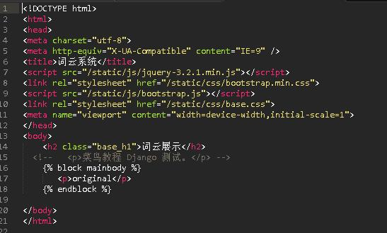  

图3 &nbsp;&nbsp;base.html母版网页  

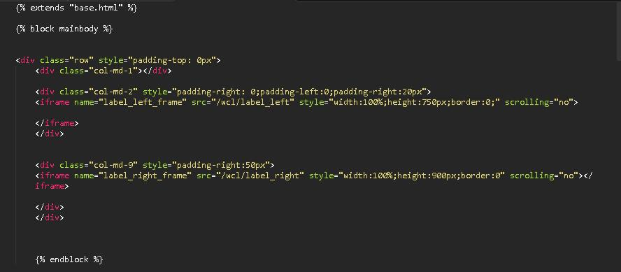  

图4 &nbsp;&nbsp;index.html框架模板网页（两个iframe）   
   
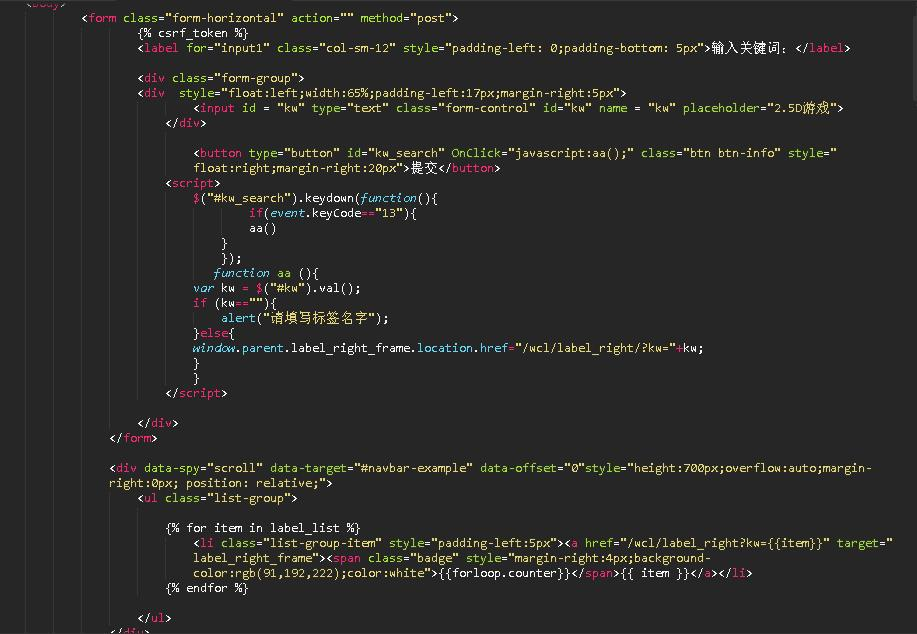  

图5&nbsp;&nbsp;label_left.html页面    

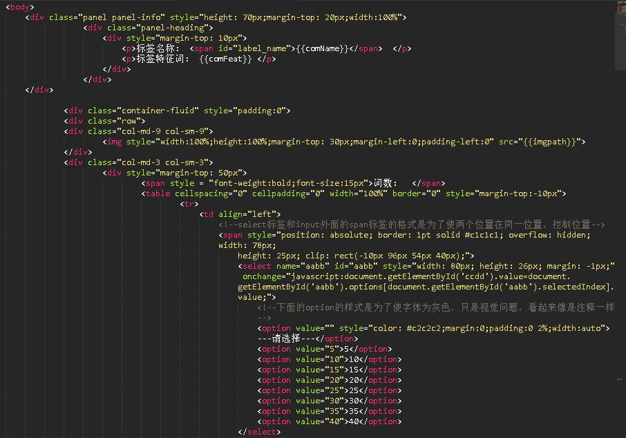  

图6 &nbsp;&nbsp;label_right.html页面    

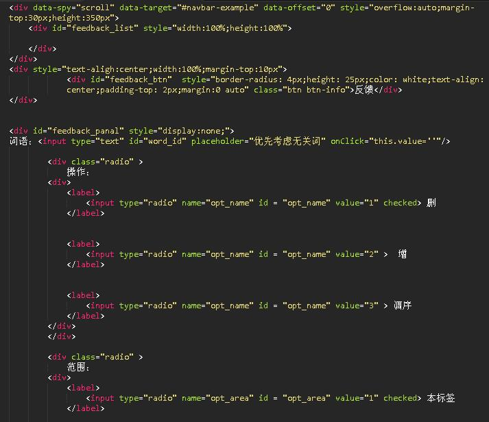  

图7 &nbsp;&nbsp;label_right.html页面   
 
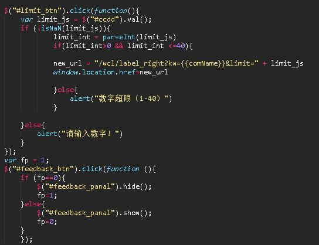  

图8 &nbsp;&nbsp;label_right.html页面  
    
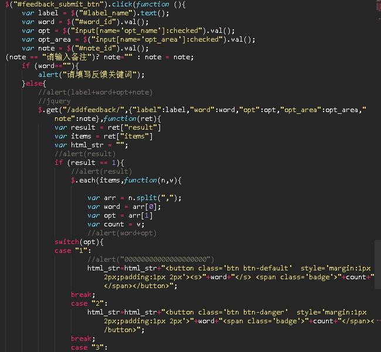  

图9 &nbsp;&nbsp;label_right.html页面  
  
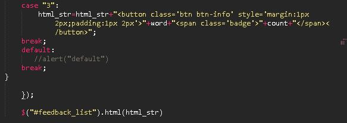    

####**2. 后端**   
**2.1 功能**  
>     后端功能主要包括：词云主页加载及所需数据、搜索标签、列表选择、词云词数调整、反馈功能等几个主要功能

首先引入python库  
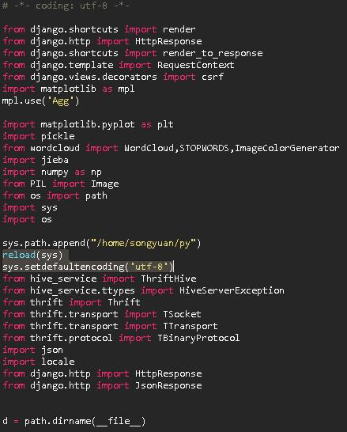 

图10 &nbsp;&nbsp; 引入库

加载主页面框架，及右侧词云图片页面  
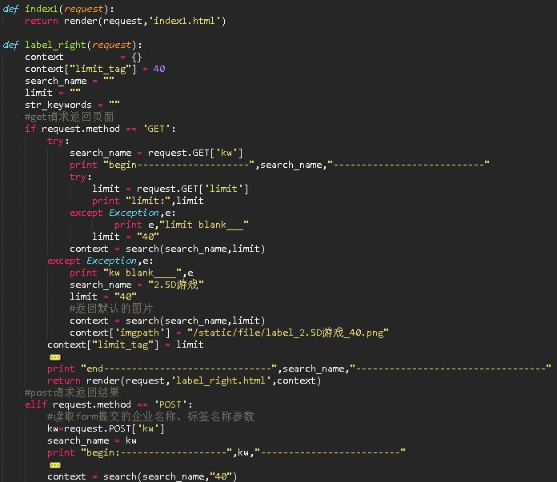

图11 &nbsp;&nbsp; 引入库

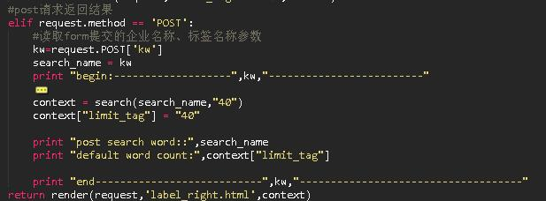  

图12 &nbsp;&nbsp; 引入库

添加反馈，并把反馈数据保存入文本文件中，用于后续分析  
  

图13 &nbsp;&nbsp; 引入库

判断是否是同一标签下重复反馈相同关键词  
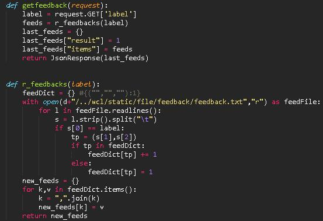  

图14 &nbsp;&nbsp; 引入库

查询hive数据库读取标签列表  
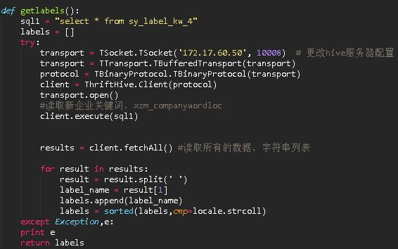  

图15 &nbsp;&nbsp; 引入库

搜索标签时从hive数据库中读取标签及对应特征向量  
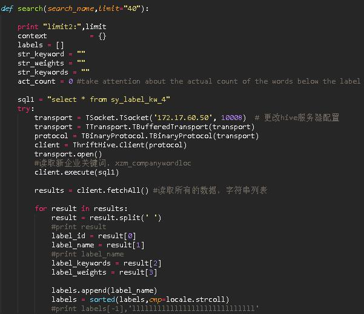  

图16 &nbsp;&nbsp; 引入库

判断该标签及对应词数的词云图片本地是否存在，存在直接返回否则调用词云框架生成新图片  
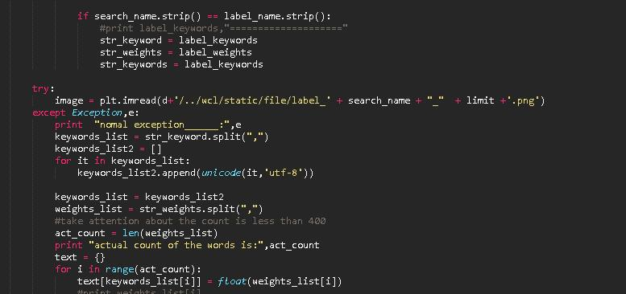  

图17 &nbsp;&nbsp; 引入库

调用wordcloud框架生成词云图片  
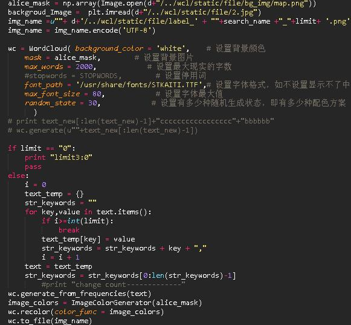  

图18 &nbsp;&nbsp; 引入库

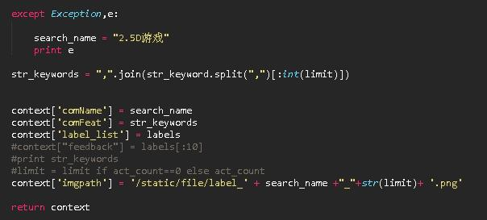 

图19 &nbsp;&nbsp; 引入库
 
  

图20 &nbsp;&nbsp; 引入库

  

