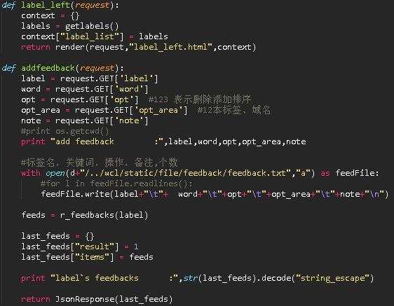

> 这个世界上肯定有另一个我，做着我不敢做的事，过着我想过的生活。挑战自己不擅长的事，敢于说走就做的旅行，每天做很多新鲜的事。极致的幸福，存在于孤独的深海。在这样日复一日的生活里，我逐渐和自己达成和解。

首先，总体介绍下这个小项目  
网站界面如下图所示：  

  
**需求**：公司由于业务需要，需要对300多万家企业进行打标签。事先人工整理好了1500多个标签然后通过solr打分框架给企业打上初步的标签，这些数据作为标签2.0的训练集进行机器学习打标签。  

**功能**：进行标签2.0的第一步对标签进行特征提取，提取出的特征向量能否有效的代表标签，以及利用标签的特征向量进行行业的初步分析，因此我们开发了词云展示系统，另外我们添加了词云反馈功能，用于让用户对词云结果提出意见，促进词云的改进。

**软件技术栈：**  
网站：django框架  
前端框架：bootstrap,jquery  
词云框架：wordcloud  
数据库：hive数据库

**具体实现**  
**1.** 前端  
需求：对1500个标签分别查看其对应词云，包括搜索、列表选择。词云展示部分包括：词云名称、词云关键词列表、词云图片、切换该词云词数功能；反馈功能：要反馈词语、操作（增、删、改）、范围（全域、本标签）、备注

实现：  
4个网页文件：base.html(母版),index.html（框架模板）,label_left.html（左侧搜标签选择部分）,label_right.html（右侧词云展示部分）

  
  
  
  
  
  
  
  

**2.** 后端  

  

